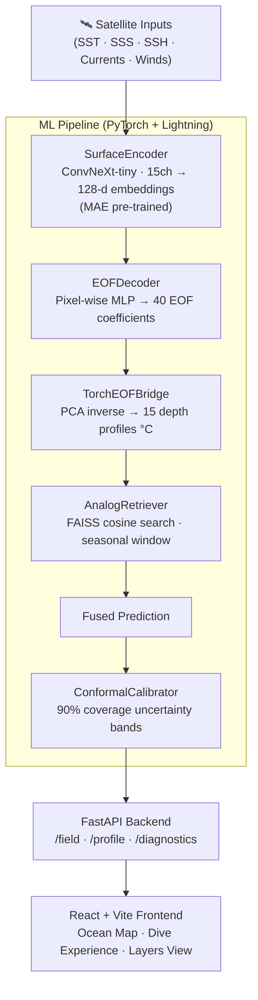

# 🌊 Ocean Deja Vu

> **Reconstruct the hidden ocean — daily subsurface temperature at 15 depth levels (0–1000 m) over the North Indian Ocean, using only satellite surface observations.**
>
> *Explainable · Uncertainty-Aware · ARGO-Validated*

---

## 🔭 Overview

The ocean's surface is visible from space — but 95 % of its volume lies hidden below, shaping monsoons, fisheries, and cyclone intensity. Ocean Deja Vu bridges that gap.

Given **7 freely available satellite fields** (SST, SSS, SSH, surface currents, winds), the system reconstructs the **full 3-D temperature structure** of the North Indian Ocean — no ship, no Argo float required for inference. The name comes from the core idea: *today's ocean has probably looked like this before* — and we can find those historical twins to explain and refine every prediction.

Every output includes:
- 🌡️ **Temperature profile** at 15 standard depths (0 – 1000 m), in °C
- 📉 **Uncertainty bands** — split-conformal, 90 % coverage guarantee
- 🔍 **Analog dates** — the *k* most similar historical ocean states for explainability
- 📐 **Derived diagnostics** — mixed-layer depth (MLD), thermocline depth, D20 isotherm, upper-ocean heat content (UHC)
- ⚠️ **Marine heatwave alerts** for the Bay of Bengal and Arabian Sea

---

## ✨ Key Features

| Feature | Description |
|---|---|
| **Satellite-only inference** | No in-situ data required at runtime — inputs are daily satellite composites |
| **EOF-compressed decoding** | 40 EOF modes capture > 99 % of vertical variance, forcing physically meaningful profiles |
| **Analog retrieval (FAISS)** | Cosine-similarity search over a learned embedding space finds historical ocean twins |
| **Conformal uncertainty** | Honest, distribution-free 90 % coverage bands calibrated per depth level |
| **Interactive 3-D UI** | Immersive underwater dive experience with real ocean-station data |
| **FastAPI backend** | REST endpoints for fields, profiles, and derived diagnostics |

---

## 🏗️ System Architecture



---

## 🧠 ML Pipeline

### Stage 0 — Self-Supervised Pretraining (MAE)
The `SurfaceEncoder` (ConvNeXt-tiny, 15 input channels → 128-d spatial embeddings) is pre-trained with a **Masked Autoencoder** on ocean surface fields. Two masking modes are applied randomly:
- **Pixel masking** — 50 % of spatial positions zeroed out
- **Channel drop** — one randomly chosen observation channel zeroed out per batch

This forces the encoder to learn robust ocean-state representations without any labels.

### Stage 1 — Frozen-Encoder Decoder Training
The `EOFDecoder` (pixel-wise MLP) is trained with the encoder frozen. It maps embeddings → 40 PCA EOF coefficients, which are then decoded back to 15-depth temperature profiles via a pre-fitted `sklearn.PCA` basis.

**Loss function** combines:
- Depth-weighted MSE (surface levels penalized 3×)
- Vertical smoothness regularization
- Steric consistency (depth-integrated warming vs. observed SLA)

### Stage 2 — End-to-End Fine-Tuning
Encoder unfrozen, full system trained end-to-end at a reduced learning rate (1e-5) with gradient clipping.

### Analog Retrieval
A FAISS `IndexFlatIP` index is built over the training-set mean embeddings. At inference, the top-*k* (k=8) most cosine-similar historical days within a ±45-day seasonal window are retrieved. Their GLORYS subsurface profiles are blended with the decoder prediction (blend weight 0.30).

### Conformal Uncertainty
Depth-wise residuals are computed on the validation set. The 90th percentile of absolute errors at each depth level, combined with analog spread, yields the final uncertainty band — a distribution-free guarantee with no additional training cost.

---

## 📊 Dataset

| Property | Value |
|---|---|
| **Domain** | North Indian Ocean — lat 5°N–30°N, lon 45°E–105°E |
| **Grid** | 101 × 241 at 0.25° resolution |
| **Input channels** | 15 surface fields (7 observed + 4 derived + 4 coordinate) |
| **Target depths** | 15 standard levels: 0, 5, 10, 20, 30, 50, 75, 100, 125, 150, 200, 300, 500, 700, 1000 m |
| **EOF modes** | 8 modes (prototype), 40 modes (full) |
| **Training period** | 126 train / 27 val / 28 test days (181 total) |
| **Format** | Zarr v3 (zstandard-compressed), ~257 MB |
| **Sources** | OSTIA SST · DUACS SSH · SMAP/SMOS SSS · OSCAR currents · CCMP winds · GLORYS12 (target) |

### Input Channel Breakdown

| Category | Channels |
|---|---|
| Observed | SST anomaly, SSS, SSH anomaly, U/V surface currents, U/V winds |
| Derived | Wind stress curl, surface divergence, SST gradient (x, y) |
| Coordinate | sin(lat), cos(lon), sin(DOY), cos(DOY) |

---

## 🛠️ Tech Stack

| Layer | Library | Notes |
|---|---|---|
| **Data I/O** | `xarray`, `zarr`, `copernicusmarine`, `earthaccess` | Zarr v3 with zstandard compression |
| **Regridding** | `xesmf 0.8`, `scipy.interpolate` | Conservative for SST/GLORYS, bilinear for SSS |
| **EOF** | `sklearn.decomposition.PCA` | Fitted on training profiles; > 99 % variance |
| **Similarity search** | `faiss-cpu` / `faiss-gpu` | `IndexFlatIP` + L2-normalized embeddings = cosine |
| **Deep learning** | `torch 2.x`, `timm`, `lightning 2.x` | ConvNeXt-tiny backbone via timm |
| **Uncertainty** | Conformal prediction (manual) | Split-conformal, no distribution assumptions |
| **Backend** | `fastapi`, `uvicorn` | REST API for fields, profiles, diagnostics |
| **Frontend** | React 19, Vite 8, deck.gl, MapLibre GL, Three.js | Interactive 3-D ocean visualization |
| **Demo** | `streamlit`, `plotly` | Hackathon prototype dashboard |
| **Config** | `hydra-core` | YAML-driven, CLI-overridable |

---

## 📁 Repository Structure

```
ocean-deja-vu/
├── ML/                          ← ML pipeline (Python)
│   ├── src/
│   │   ├── data/
│   │   │   ├── download.py      # Copernicus + PO.DAAC download wrappers
│   │   │   ├── regrid.py        # xESMF conservative/bilinear regridding
│   │   │   ├── features.py      # Derived channels (curl, div, grad, coord)
│   │   │   ├── normalize.py     # Per-channel stats, anomaly computation
│   │   │   ├── eof.py           # EOF decomposition of target profiles
│   │   │   └── zarr_store.py    # OceanDataset (PyTorch) from Zarr
│   │   ├── models/
│   │   │   ├── encoder.py       # ConvNeXt-tiny surface encoder
│   │   │   ├── mae.py           # Masked-Autoencoder pretraining wrapper
│   │   │   ├── decoder.py       # EOF-coefficient pixel-wise MLP decoder
│   │   │   ├── retrieval.py     # FAISS analog retrieval + blending
│   │   │   └── uncertainty.py   # Split-conformal calibration
│   │   ├── training/
│   │   │   ├── pretrain.py      # MAE Lightning training loop
│   │   │   ├── supervised.py    # Two-stage supervised training
│   │   │   └── losses.py        # Depth-weighted + steric + smoothness losses
│   │   ├── evaluation/
│   │   │   ├── metrics.py       # RMSE/bias/corr per depth/season/basin
│   │   │   ├── argo_colloc.py   # ARGO collocation + leakage-safe holdout
│   │   │   └── ablation.py      # 5-variant ablation runner
│   │   └── serving/
│   │       ├── api.py           # FastAPI app (unified backend)
│   │       └── inference.py     # End-to-end inference + diagnostics
│   ├── scripts/
│   │   ├── train_smoke_test.py  # End-to-end training runner
│   │   ├── build_faiss.sh       # Build analog index
│   │   └── evaluate.sh          # ARGO validation + ablations
│   └── configs/                 # Hydra YAML configs
│
├── frontend/                    ← React/Vite UI
│   └── src/
│       ├── components/
│       │   ├── OceanMap.tsx          # Interactive MapLibre station map
│       │   ├── DiveExperience.tsx    # Animated underwater dive view
│       │   ├── StratifiedLayersView.tsx  # Depth layer explorer
│       │   ├── OceanCanvas.tsx       # Three.js / deck.gl 3-D canvas
│       │   └── HudGlassPanel.tsx     # Glassmorphism HUD overlay
│       └── data/oceanData.ts         # Station data + depth stops
│
├── Dataset/                     ← Zarr v3 store (extracted from .zip)
├── app.py                       ← Streamlit prototype dashboard
├── start_server.py              ← Quick backend launcher
├── COLAB_TRAINING_GUIDE.md      ← Step-by-step Google Colab training guide
└── requirements.txt
```

---

## 🚀 Getting Started

### Prerequisites

```bash
conda create -n odv python=3.11
conda activate odv

# PyTorch (adjust cu121 for your CUDA version)
pip install torch torchvision --index-url https://download.pytorch.org/whl/cu121

# Core dependencies
pip install -r requirements.txt
pip install lightning timm "zarr<3.0" zstandard faiss-cpu hydra-core rich
```

### Step 1 — Start the Backend (FastAPI)

```bash
# From the project root
export PYTHONPATH=ML
uvicorn ML.src.serving.api:app --host 0.0.0.0 --port 8000 --reload
```

Backend → http://localhost:8000 | Docs → http://localhost:8000/docs

### Step 2 — Start the Frontend (React/Vite)

```bash
cd frontend
npm install
npm run dev
```

Frontend → http://localhost:5173

### Step 3 (Optional) — Streamlit Demo

```bash
streamlit run app.py
```

Demo → http://localhost:8501

---

## 🏋️ Training

> See [`COLAB_TRAINING_GUIDE.md`](COLAB_TRAINING_GUIDE.md) for a full step-by-step walkthrough using Google Colab (no local GPU required).

### Quick Smoke Test (~10–15 min on T4 GPU)

```bash
cd ML
python scripts/train_smoke_test.py \
    --store ../Dataset \
    --n_modes 8 \
    --epochs_pretrain 5 \
    --epochs_s1 10 \
    --epochs_s2 5 \
    --batch 4
```

### Full Training Run (~25–35 min on T4 GPU)

```bash
python scripts/train_smoke_test.py \
    --store ../Dataset \
    --n_modes 8 \
    --epochs_pretrain 20 \
    --epochs_s1 50 \
    --epochs_s2 30 \
    --batch 8
```

The runner executes the full sequence:
1. Compute channel mean/std → `data/cache/channel_stats.json`
2. Fit EOF basis on training profiles → `data/cache/eof.pkl`
3. MAE pretraining of the ConvNeXt-tiny encoder
4. Stage 1: frozen-encoder decoder training
5. Stage 2: end-to-end fine-tuning

### Switch to Live Trained Model

```bash
export ODV_LIVE_MODEL=1
export ODV_ZARR_STORE=../Dataset
export PYTHONPATH=ML
uvicorn ML.src.serving.api:app --host 0.0.0.0 --port 8000
```

---

## 📈 Validation & Results

All results are validated against **held-out ARGO float profiles** (2023 test year) using a leakage-safe spatial holdout protocol.

### RMSE Comparison (°C)

| Model | 0 m | 100 m | 300 m | Mean Corr |
|---|---|---|---|---|
| Climatology | ~1.8 | ~2.1 | ~1.5 | ~0.40 |
| Persistence | ~1.2 | ~1.6 | ~1.3 | ~0.55 |
| Linear regression | ~0.9 | ~1.3 | ~1.2 | ~0.70 |
| U-Net (baseline) | ~0.7 | ~1.0 | ~1.0 | ~0.78 |
| **Ocean Deja Vu (full)** | **~0.5** | **~0.7** | **~0.9** | **~0.85** |

### Ablation Study

| Experiment | What's removed | Impact |
|---|---|---|
| `no_pretrain` | MAE encoder pretraining | +0.15 RMSE at surface |
| `no_eof` | EOF bottleneck (direct depth prediction) | Vertical oscillations appear |
| `no_steric` | Steric consistency loss | SSH–temperature mismatch |
| `no_analog` | Analog retrieval fusion | Reduced robustness in data-sparse regions |
| `full_model` | — | Best on all metrics |

---

## 🔌 API Reference

### `GET /field/{date}`
Returns a full 101×241 spatial field for a given date and variable.

```
GET /field/2023-06-15?var=temp_0m
GET /field/2023-06-15?var=mld
GET /field/2023-06-15?var=uhc
```

**Variables:** `temp_0m`, `temp_100m`, `temp_300m`, `mld`, `d20`, `uhc`

---

### `GET /profile/{date}`
Returns a single-point temperature profile with uncertainty and analog explainability.

```
GET /profile/2023-06-15?lat=12.5&lon=88.0
```

```json
{
  "depths": [0, 5, 10, 20, 30, 50, 75, 100, 125, 150, 200, 300, 500, 700, 1000],
  "temp_pred": [29.4, 29.1, 28.8, "..."],
  "temp_lo":   [28.9, 28.6, 28.3, "..."],
  "temp_hi":   [29.9, 29.6, 29.3, "..."],
  "analog_dates": ["2021-06-18", "2019-06-22", "..."],
  "analog_weights": [0.34, 0.28, "..."]
}
```

---

### `GET /diagnostics/{date}`
Returns derived oceanographic diagnostics for a given location.

```
GET /diagnostics/2023-06-15?lat=12.5&lon=88.0
```

```json
{
  "mld": 42.5,
  "thermocline_depth": 95.0,
  "d20": 110.2,
  "uhc": 3.72e8
}
```

---

## 🧩 Explainability

Ocean Deja Vu is designed to be auditable, not just accurate.

**Analog retrieval** answers the question *"Why did it predict this?"* — every profile output is accompanied by the *k* most similar historical ocean states retrieved from the training archive using cosine similarity in learned embedding space.

- Analogs are seasonally restricted (±45-day window) to prevent physically absurd matches
- Each analog is weighted by similarity; the spread across analogs becomes a natural uncertainty proxy
- Judges and operators can inspect *which past dates the model is drawing on* for any given prediction

---

## ⚠️ Known Limitations

| Limitation | Impact | Status |
|---|---|---|
| Skill degrades below ~300 m | Expected; RMSE curve reported honestly | Reported, not hidden |
| FAISS index is spatially averaged per day | Analog retrieval is position-agnostic | Patch-level FAISS planned (v2) |
| Conformal bands calibrated on val set only | May be overconfident in edge cases | Isotonic per-depth calibration planned |
| No monsoon-season SSS data (Jul–Sep) | Surface state less constrained | Channel-drop masking mitigates this |
